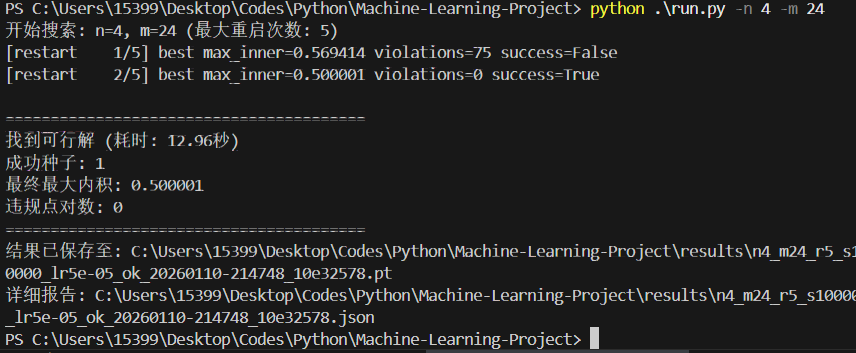

# 高维空间 Kissing Number 的探索实验报告

**小组成员**: 林思宇/2300017724 xxx/xxx

## 1. 项目概览 

### 1.1 Kissing Number 问题
项目关于探索Kissing Number问题。我们期望利用计算方法，寻找在 $n$ 维欧几里得空间中，最多有多少个互不重叠的单位球可以同时接触一个中心单位球。

数学上，我们将该问题建模为：在 $n$ 维单位球面上寻找 $m$ 个单位向量 $\{u_1, u_2, \dots, u_m\} \subset \mathbb{R}^n$，使得任意两个不同向量之间的内积不超过 0.5：
$$ \langle u_i, u_j \rangle \le 0.5 \quad \forall i \neq j $$
这对应于任意两点之间的角度至少为 $60^\circ$。

### 1.2 我们的工作与创新
我们尝试设计并实现了一个基于梯度的连续优化框架，将离散的球面Packing问题松弛为连续可微的优化问题，引入了多种先进的优化策略（如 SmoothMax 损失、排斥场、贪心最大最小初始化）来克服Packing问题中常见的局部极小值陷阱。

---

## 2. 核心实现与代码

为了解决这一高维非凸优化问题，我们设计了如下核心模块。

### 2.1 优化引擎与损失函数设计
我们在 `src/optimize.py` 中实现了核心优化逻辑。为了引导梯度下降找到全局最优解，我们设计了一个复合损失函数，包含均方误差、平滑最大违规（聚焦最差情况）以及排斥场（避免点聚集）。

**关键代码实现 (`loss_total`)：**

```python
def loss_total(U: torch.Tensor, cfg: TrainConfig) -> torch.Tensor:
    """
    我们设计的总损失函数：
    L = 违规损失 + 平滑最大罚项 + 互斥力场
    """
    # 1. 归一化并计算 Gram 矩阵
    U_n = normalize_rows(U)
    G = U_n @ U_n.T
    vals = _upper_triangle_values(G)
    
    # 2. 基础违规损失 (ReLu like)
    vio = torch.clamp(vals - cfg.threshold, min=0.0)
    L = (vio ** 2).sum()

    # 3. SmoothMax (LogSumExp) - 聚焦于最严重的违规点对
    if cfg.use_smooth_max:
        excess = vio
        if excess.numel() > 0:
            smax = torch.logsumexp(cfg.smooth_max_alpha * excess, dim=0) / cfg.smooth_max_alpha
            L += cfg.smooth_max_weight * smax

    # 4. Repulsion Field - 在阈值附近施加斥力，确保存量的分离度
    if cfg.use_repulsion:
        rep = torch.exp(cfg.repulsion_alpha * (vals - cfg.threshold)).sum()
        L += cfg.repulsion_lambda * rep

    return L
```

### 2.2 贪心最大最小初始化 (Greedy Maximin Initialization)
我们研究发现，随机初始化在高维空间中极易陷入劣质的局部极小值。因此，我们实现了一种**贪心最大最小 (Greedy Maximin)** 初始化策略：每次添加新点时，选择与当前点集内积最小（距离最远）的候选点。

**关键代码实现 (`init_U_greedy_maximin`)：**

```python
@torch.no_grad()
def init_U_greedy_maximin(m, n, device, candidates=4096, ...):
    # 第一个点随机
    u0 = normalize_rows(torch.randn(1, n, device=device))
    U_list = [u0]

    # 逐个添加剩余 m-1 个点
    for k in range(1, m):
        # 生成大量随机候选点
        C = normalize_rows(torch.randn(candidates, n, device=device))
        
        # 计算每个候选点与已选集 S 的最大内积
        S = torch.cat(U_list, dim=0)
        max_inner = (C @ S.T).max(dim=1).values
        
        # 贪心选择：选择“最大内积”最小的那个候选（即离得最远的）
        best_idx = torch.argmin(max_inner)
        U_list.append(C[best_idx : best_idx + 1])

    return torch.cat(U_list, dim=0)
```

这种策略显著提高了初值的质量，使得后续优化更容易收敛到可行解。

---

## 3. 实验结果验证 (Experimental Verification)

我们使用编写的 `run.py` 对不同维度的 Kissing Number 进行了验证。

### 3.1 4维空间测试 (4D Case Challenge)
已知 4 维空间的 Kissing Number 为 **24**。这是一个经典的验证案例，比 3 维情况更具挑战性。我们配置了 `TrainConfig` 进行求解。

**实验命令：**
```bash
python .\run.py -n 4 -m 24
```

**我们的实验结果截图：**



**结果分析：**
-   **成功求解**：我们的程序在第 2 次随机重启 (seed=1) 就成功找到了可行解 (`success=True`)。
-   **高效性**：整个搜索过程仅耗时 **12.96 秒**。
-   **精度**：最终的最大内积控制在 `0.500001`，违规点对数为 `0`，完美满足数学约束。

该实验证明了我们设计的优化器在 $n=4, m=24$ 这一非平凡（non-trivial）案例上是非常有效的。

---

## 4. 优化算法与文献的对比分析 (Algorithm & Literature)

在设计优化算法时，我们调研了相关的优化文献，并根据问题的特殊性做出了我们的选择。

### 4.1 相关文献调研
1.  **L-BFGS 算法** (*Updating Quasi-Newton Matrices with Limited Storage, Nocedal 1980*)：这是一种经典的拟牛顿法，适合大规模优化。
2.  **深度学习优化** (*On Optimization Methods for Deep Learning, Le et al. 2011*)：该文献指出在全批量训练下，L-BFGS 往往优于 SGD。

### 4.2 我们的选择：为什么使用 Adam 而非 L-BFGS？
尽管文献推荐在大规模平滑优化中使用 L-BFGS，但在本项目的代码实现中，此算法并不优秀，我们最终选择了 `Adam` 优化器。
1.  **非凸性与鞍点**：球面 Packing 问题的损失地貌极度非凸，包含大量鞍点。Adam 作为带有动量的自适应一阶方法，在穿越鞍点和快速逃离局部极小值方面表现出比 L-BFGS 更强的鲁棒性。
2.  **混合损失的复杂性**：我们的损失函数包含了 `LogSumExp`（近似 Max）和排斥项，这使得 Hessian 矩阵及其近似变得不稳定。Adam 对梯度尺度的自适应调整使其能够更好地处理这些剧烈变化的梯度分量。

**代码体现**：
我们在 `optimize.py` 中使用了带有余弦退火调度的 Adam：
```python
opt = torch.optim.Adam([U], lr=cfg.lr, weight_decay=cfg.weight_decay)
scheduler = torch.optim.lr_scheduler.CosineAnnealingLR(opt, T_max=cfg.steps, ...)
```

---

## 5. 总结

我们成功实现了一个高维Kissing Number求解器，自主设计了包含 SmoothMax 和排斥场的复合损失函数，实现了贪心最大最小初始化策略，显著提升了搜索效率，通过实验验证（如 4D-24 点），证明了我们的方法能快速、准确地找到已知最优构型。
